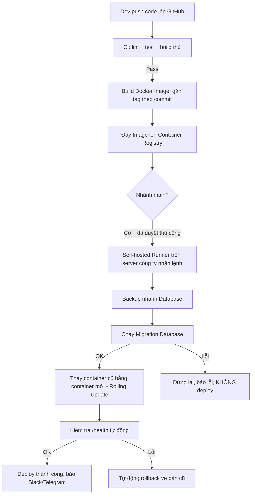

# CPA HCM Portal — Roadmap Triển Khai CI/CD lên Production (On-Premise)

> Tài liệu này giải thích **từng bước, bằng ngôn ngữ dễ hiểu**, cách đưa hệ thống từ chạy trên máy cá nhân (localhost) sang chạy ổn định trên **server vật lý riêng của công ty**, có quy trình tự động: code push lên → tự động kiểm tra → tự động build → tự động deploy.
>
> **Cập nhật 2026-07-30:** toàn bộ phần "viết code/cấu hình" (Dockerfile, docker-compose, Nginx, GitHub Actions, script deploy/backup) đã được **dựng xong và test build/chạy thử thật** trên máy — xem Mục 8 để biết chính xác việc gì đã xong, việc gì cần bạn cung cấp/thực hiện tiếp trên server thật.

## 0. Vài khái niệm cần biết trước (đọc 1 lần là hiểu cả tài liệu)

| Thuật ngữ | Giải thích đơn giản |
|---|---|
| **CI (Continuous Integration)** | Mỗi khi có người push code lên, máy tính tự động chạy kiểm tra (lỗi cú pháp, test, build thử) — để phát hiện lỗi ngay, không đợi đến lúc deploy mới biết. |
| **CD (Continuous Deployment)** | Sau khi CI báo "code ổn", máy tính tự động đưa code đó lên chạy thật trên server, không cần ai phải tự tay copy file / gõ lệnh. |
| **On-premise** | Server vật lý đặt tại công ty, tự quản lý (khác với "cloud" là thuê server của AWS/Google). Nghĩa là **mình phải tự làm mọi thứ mà bình thường nhà cung cấp cloud làm sẵn** (bảo mật, backup, mạng...). |
| **Docker / Container** | Đóng gói ứng dụng + toàn bộ thứ nó cần (Node.js, thư viện...) vào một "hộp" gọi là container. Chạy ở đâu cũng giống hệt nhau, không lo "máy tôi chạy được máy anh không chạy được". |
| **Docker Compose** | File cấu hình (`docker-compose.yml`) mô tả nhiều container (backend, frontend, database...) chạy cùng nhau như thế nào. Dự án đã có sẵn file này (hiện chỉa có Postgres + Redis). |
| **Runner (self-hosted)** | Một "cỗ máy" (có thể chính là server production) được cài đặt để lắng nghe lệnh từ GitHub Actions và thực thi lệnh đó (build, deploy...). Vì server là on-prem không có cloud, đây là **mảnh ghép quan trọng nhất** để nối GitHub với server công ty. |
| **Migration (database)** | Khi cấu trúc bảng dữ liệu thay đổi (thêm cột, đổi tên bảng...), migration là các file lệnh SQL để cập nhật database theo đúng thay đổi đó, thay vì phải sửa tay. |
| **Volume (Docker)** | Một "ổ đĩa ảo" mà Docker quản lý, dùng để lưu dữ liệu **bên ngoài** container — để khi xoá/deploy lại container, dữ liệu (database, file upload) **không bị mất**. |
| **Object Storage (MinIO)** | Một kho lưu file chuyên dụng (giống Amazon S3 nhưng tự cài trên server riêng), tách biệt hẳn khỏi ứng dụng — file không phụ thuộc vòng đời của container app. |

---

## 1. Hiện trạng dự án (điểm xuất phát)

Đã kiểm tra thực tế repo, ghi nhận:

- ✅ Backend NestJS + Prisma ORM + PostgreSQL 15 + Redis 7 — đã có `docker-compose.yml` cho Postgres/Redis (dùng cho dev local).
- ✅ Frontend Next.js 16.
- ✅ Thư mục `backend/uploads/` (ảnh public) và `backend/uploads-private/` (chứng từ nhạy cảm) đã được `.gitignore` đúng cách.
- ✅ **[Đã xong]** `Dockerfile` cho backend (multi-stage: build → migrator riêng → runtime gọn nhẹ) và frontend (Next.js `output: standalone`) — đã build thật bằng Docker và chạy được.
- ✅ **[Đã xong]** `docker-compose.yml` mở rộng đủ 6 service (`postgres`, `redis`, `backend`, `backend-migrate`, `frontend`, `nginx`, `certbot`) + đã sửa lỗi hardcode mật khẩu.
- ✅ **[Đã xong]** `.github/workflows/ci.yml` + `cd.yml`, script `scripts/deploy.sh|backup-db.sh|backup-uploads.sh|restore-db.sh`.
- ✅ **[Đã xong]** Đã chạy thử thật (`docker compose run backend-migrate`, `docker compose up backend frontend`) — migration, kết nối DB/Redis nội bộ, healthcheck đều hoạt động đúng.
- ⚠️ **[Còn nợ]** Codebase có ~181 lỗi ESLint có sẵn (không liên quan tới CI/CD) và trước đó có 3 unit test suite bị lỗi (đã sửa 3 suite, còn lint chưa dọn) — xem Mục 8.
- ❌ **[Chưa làm được — cần bạn]** Chưa có server thật, chưa có GitHub repo (git remote trống) — mọi việc còn lại trong Giai đoạn 0/1 cần thực hiện trên hạ tầng thật, xem Mục 8.

---

## 2. Sơ đồ tổng quan luồng CI/CD



**Vì sao cần "Self-hosted Runner"?** Do server đặt tại công ty (on-prem), GitHub (ở "trên mây") không thể tự tay SSH vào máy công ty được vì lý do bảo mật (sẽ phải mở port ra Internet, rất rủi ro). Giải pháp: cài một chương trình nhỏ (runner) ngay trên server công ty, nó sẽ **tự động hỏi GitHub "có việc gì cần làm không?"** và tự thực thi tại chỗ — không cần mở port SSH ra ngoài.

---

## 3. Roadmap theo giai đoạn

### Giai đoạn 0 — Chuẩn bị hạ tầng server (Tuần 1–2)

Mục tiêu: server sẵn sàng chạy container, an toàn, có SSL.

- [x] Viết `Dockerfile` cho backend (NestJS, multi-stage: `deps`→`build`→`migrator`/`prod-deps`→`runner`) — đã `docker build` thành công thật.
- [x] Viết `Dockerfile` cho frontend (Next.js, `output: standalone`) — đã `docker build` thành công thật (phát hiện & sửa luôn 2 lỗi code chặn build, xem Mục 8).
- [x] Mở rộng `docker-compose.yml` hiện có: thêm service `backend`, `backend-migrate`, `frontend`, `nginx`, `certbot` bên cạnh `postgres`/`redis`.
- [x] **Sửa lỗi bảo mật**: mật khẩu Postgres không còn hardcode, đọc từ `.env` (`.env.example` đã tạo sẵn ở gốc repo).
- [x] Viết `nginx/nginx.conf` (reverse proxy + chỗ cho SSL Let's Encrypt).
- [ ] **[Cần bạn — trên server thật]** Tạo user riêng để deploy (không dùng `root`), chỉ cho SSH đăng nhập bằng key (tắt đăng nhập bằng mật khẩu).
- [ ] **[Cần bạn]** Cấu hình firewall (UFW) — chỉ mở cổng 22 (SSH), 80, 443 ra ngoài.
- [ ] **[Cần bạn]** Cài `fail2ban` để chặn brute-force SSH.
- [ ] **[Cần bạn]** Cài Docker Engine + Docker Compose plugin trên server thật.
- [ ] **[Cần bạn]** Cài **self-hosted GitHub Actions runner** trên server (cần GitHub repo tồn tại trước — xem Mục 8).
- [ ] (Tuỳ chọn, nếu tài nguyên đủ) Dựng thêm 1 bộ container "staging" — môi trường thử nghiệm trước khi lên thật.

### Giai đoạn 1 — Chuẩn hóa quy trình Git (Tuần 3)

Mục tiêu: tránh code lỗi bị đẩy thẳng lên production.

- [ ] **[Cần bạn]** Tạo repository trên GitHub, đẩy code hiện tại lên (`git remote add origin ...` rồi push) — repo hiện **chưa có remote nào**.
- [ ] **[Cần bạn]** Quy ước nhánh: `main` (production), `develop` (staging), `feature/...`, `hotfix/...`
- [ ] **[Cần bạn]** Bật "Branch protection" cho `main`: bắt buộc phải có Pull Request + CI (`ci.yml`) pass mới được merge
- [ ] **[Cần bạn]** Tạo GitHub Environment tên `production` (Settings > Environments), bật **"Required reviewers"** — `cd.yml` đã tham chiếu sẵn `environment: production`, chỉ cần bật ở đây là job "deploy" sẽ tự dừng chờ duyệt.

### Giai đoạn 2 — Xây dựng CI (Kiểm tra tự động) (Tuần 4–5)

Đã viết xong `.github/workflows/ci.yml`, chạy trên mọi push/PR:

- [x] `eslint` — **đang để `continue-on-error: true` tạm thời** vì codebase có sẵn ~181 lỗi lint chưa liên quan tới CI/CD (xem Mục 8) — không chặn merge cho tới khi dọn xong.
- [x] `tsc` (qua `nest build`) — kiểm tra lỗi kiểu dữ liệu TypeScript, ĐANG chặn merge nếu lỗi.
- [x] `npx prisma validate` — kiểm tra schema database có hợp lệ không.
- [x] `jest` — chạy unit test backend (153/153 test đang pass sau khi sửa 3 file test bị lỗi — xem Mục 8).
- [x] `next build` — thử build frontend, ĐANG chặn merge nếu lỗi (đã phát hiện & sửa 2 lỗi thật trong lúc build test — xem Mục 8).
- [ ] Playwright E2E test — CHƯA thêm vào CI (cần Postgres tạm trong job, có thể làm ở bước sau nếu cần).
- [x] Build + push Docker Image lên **ghcr.io** (GitHub Container Registry) — nằm trong `cd.yml`, chỉ chạy khi vào nhánh `main` (không chạy ở mọi PR để tiết kiệm thời gian CI).

> `ci.yml` chạy mọi push/PR (nhanh, không build image) — `cd.yml` chỉ chạy khi vào `main` (build + push image + deploy).

### Giai đoạn 3 — Xây dựng CD (Deploy tự động) (Tuần 6)

Đã viết xong `.github/workflows/cd.yml` + `scripts/deploy.sh`, chạy khi code vào `main` và người phụ trách bấm duyệt (approval gate ở Giai đoạn 1):

- [x] Runner trên server nhận lệnh, chạy `docker compose pull` (tải image mới nhất) — đã test bằng `docker compose run/up` cục bộ, hoạt động đúng.
- [x] **Backup nhanh** database (`pg_dump` qua `scripts/backup-db.sh`) trước khi thay đổi bất cứ điều gì.
- [x] Chạy migration qua container `backend-migrate` riêng (chi tiết ở Mục 4) — đã test thật, chạy đúng, không pending migration nào bị bỏ sót.
- [x] Nếu migration thành công → thay container cũ bằng container mới (`docker compose up -d --no-deps backend frontend`) — script **không bao giờ dùng `down -v`**.
- [x] Gọi thử endpoint `/api/v1` (health có sẵn) để chắc chắn app mới chạy đúng ("smoke test").
- [x] Nếu health check lỗi → tự động rollback dùng image tag cũ trước đó (đọc từ file `.deploy_state`).
- [x] Bước thông báo Slack/Telegram (tuỳ chọn, chỉ chạy nếu có secret `DEPLOY_NOTIFY_WEBHOOK_URL` — xem Mục 8).

### Giai đoạn 4 — Giám sát & Sao lưu lâu dài (Tuần 7 trở đi)

- [x] Endpoint health check đã có sẵn tại `GET /api/v1` (trả `status: ONLINE` + timestamp) — dùng luôn cho smoke test của `deploy.sh`, không cần thêm endpoint mới.
- [x] `scripts/restore-db.sh` — script khôi phục từ file backup, dùng để test restore định kỳ hằng tháng.
- [ ] **[Cần bạn — trên server thật]** Thêm cron job gọi `scripts/backup-db.sh` và `scripts/backup-uploads.sh` hằng ngày (lệnh cron mẫu đã có sẵn trong comment đầu mỗi file).
- [ ] **[Cần bạn]** Ghi log tập trung — `journald` + `logrotate`, hoặc xem Docker logging driver.
- [ ] **[Cần bạn]** Cài **Uptime Kuma** để theo dõi server 24/7.
- [ ] **[Cần bạn]** Thử chạy `scripts/restore-db.sh` với 1 file backup thật ít nhất 1 lần để xác nhận quy trình restore hoạt động.

---

## 4. Giải pháp Database — Setup & Migration tự động

### Setup an toàn

- [x] Giữ PostgreSQL chạy trong Docker + named volume `postgres_data` (đã có sẵn, đúng hướng).
- [x] Cổng `5432`/`6379` chỉ bind `127.0.0.1` (đã sửa trong `docker-compose.yml`) — máy dev vẫn dùng `localhost:5432` như cũ, nhưng trên server production sẽ không lộ ra ngoài.
- [x] Mật khẩu/user database đọc từ `.env` (root), không hardcode trong `docker-compose.yml`.
- [x] `scripts/backup-db.sh` — nén `pg_dump`, tự xoá backup cũ hơn 30 ngày, có sẵn dòng lệnh cron mẫu.
- [ ] **[Cần bạn]** Đẩy thư mục `backups/` sang ổ đĩa/NAS/server khác định kỳ — script chỉ lưu cục bộ trên server, KHÔNG tự đẩy đi nơi khác.

### Migration tự động trong pipeline

**Nguyên tắc cốt lõi:** chỉ dùng lệnh `npx prisma migrate deploy` trên production — đây là lệnh **an toàn**, chỉ áp dụng các file migration đã có sẵn trong `backend/prisma/migrations` (đã được viết & test khi dev ở local bằng `prisma migrate dev`). Lệnh này **không tự ý sinh ra thay đổi mới**, nên không có rủi ro "đoán sai" cấu trúc bảng.

Thứ tự chạy trong pipeline CD (rất quan trọng, phải đúng thứ tự):

1. Backup nhanh database (`pg_dump`) — có đường lùi nếu bước sau lỗi
2. Chạy `npx prisma migrate deploy` bằng chính image mới, kết nối tới database production
3. Nếu migrate **thành công** → mới tiến hành thay container backend bằng bản mới
4. Nếu migrate **thất bại** → dừng toàn bộ pipeline ngay, gửi cảnh báo, **không đụng** vào container đang chạy (app cũ vẫn tiếp tục hoạt động bình thường)

**Lưu ý quan trọng:**
- Không bao giờ chạy `prisma migrate dev` hoặc `prisma db push` trên production (2 lệnh này dùng cho dev local, có thể gây mất dữ liệu).
- Khi review Pull Request có migration, cần đọc kỹ xem có lệnh nguy hiểm như `DROP COLUMN`, `DROP TABLE` không — nếu có, cân nhắc kỹ trước khi merge.

---

## 5. Giải pháp lưu trữ File/Ảnh (Upload)

### So sánh 3 phương án

| Tiêu chí | Local FS trực tiếp | Docker Volume (bind mount) | MinIO (Object Storage) |
|---|---|---|---|
| Độ khó khi setup | Dễ nhất | Dễ | Trung bình (thêm service + code SDK) |
| An toàn khi deploy lại (không mất file) | Rủi ro nếu cấu hình sai | An toàn nếu mount đúng | An toàn tuyệt đối — tách hẳn khỏi app |
| Bảo mật file nhạy cảm (`uploads-private`) | Phải tự viết logic kiểm tra quyền | Giống Local FS | Có sẵn "presigned URL" (link tải có thời hạn, bảo mật hơn) |
| Khả năng mở rộng sau này (nhiều server, CDN, chuyển lên cloud) | Kém | Kém (vẫn 1 server) | Tốt — cùng chuẩn API với Amazon S3, sau này đổi sang cloud rất dễ |
| Chi phí vận hành thêm | Không | Không | Có — thêm 1 service cần theo dõi/backup riêng |

### Khuyến nghị cho dự án này

**[Đã áp dụng trong `docker-compose.yml`]** Giai đoạn đầu dùng **Docker Volume kiểu "bind mount"** — thư mục `./data/uploads` và `./data/uploads-private` (nằm ngay cạnh `docker-compose.yml`, đã thêm vào `.gitignore`) được gắn thẳng vào container backend:

```yaml
backend:
  volumes:
    - ./data/uploads:/app/uploads
    - ./data/uploads-private:/app/uploads-private
```

Cách này dễ backup bằng `rsync`/`tar` trực tiếp trên server (`scripts/backup-uploads.sh` đã viết sẵn), dễ kiểm tra file thủ công khi cần debug.

**Giai đoạn sau (khi hệ thống ổn định, có thời gian đầu tư thêm):** nên chuyển sang **MinIO** — cài thêm 1 service MinIO ngay trên server, sửa code backend dùng thư viện `@aws-sdk/client-s3` (tương thích 100% với MinIO) thay cho việc ghi file trực tiếp bằng `fs.writeFile`. Lý do nên làm sớm nếu có thể: dự án đang xử lý **chứng từ tài chính nhạy cảm** (`uploads-private`) — MinIO cho phép tạo **link tải có thời hạn (presigned URL)** thay vì để file nằm mở trên server, an toàn hơn hẳn.

### Quy tắc bắt buộc để KHÔNG BAO GIỜ mất file khi deploy bản mới

1. [x] Khai báo volume/bind mount trong `docker-compose.yml` — Dockerfile backend **không** `COPY` thư mục uploads từ source code (đã kiểm tra, chỉ `mkdir -p` thư mục rỗng làm mount point).
2. [x] `scripts/deploy.sh` chỉ dùng `docker compose pull` + `up -d --no-deps` — **không có** `down -v` ở bất kỳ đâu trong toàn bộ script.
3. [x] `uploads/`, `uploads-private/` (backend) và `data/` (root, nơi thật sự mount) đều đã có trong `.gitignore`/`.dockerignore`.
4. [x] `scripts/backup-uploads.sh` chạy độc lập với `backup-db.sh`, theo lịch cron riêng (lệnh mẫu có sẵn trong comment đầu file).

---

## 6. Bảng tổng hợp timeline

| Tuần | Giai đoạn | Kết quả đạt được |
|---|---|---|
| 1–2 | Hạ tầng nền tảng | Server có Docker, SSL, firewall, runner sẵn sàng |
| 3 | Quy trình Git | Branch protection + approval gate cho production |
| 4–5 | CI | Mọi Pull Request tự động lint/test/build/đóng gói image |
| 6 | CD | Deploy production tự động, có migration an toàn + rollback |
| 7+ | Giám sát & Backup | Theo dõi uptime, backup tự động DB + file, có thể restore |

## 7. Việc cần sửa ngay lập tức — ĐÃ XONG

- [x] Bỏ hardcode mật khẩu Postgres trong `docker-compose.yml` → đọc từ `.env`.
- [x] Cổng `5432`/`6379` chỉ bind `127.0.0.1`, không lộ ra ngoài.

---

## 8. Những gì đã làm xong và những gì cần bạn cung cấp/thực hiện tiếp

### Đã dựng xong + test thật (không cần làm lại)

Toàn bộ phần dưới đây đã được viết và **kiểm chứng bằng `docker build` + `docker compose up` thật** trên máy (không chỉ viết suông):

- `backend/Dockerfile`, `backend/.dockerignore` — build thành công cả 2 stage `runner` và `migrator`.
- `frontend/Dockerfile`, `frontend/.dockerignore`, `frontend/next.config.ts` (thêm `output: standalone`) — build thành công.
- `docker-compose.yml` (gốc repo) — đủ 6 service, đã chạy thử `backend-migrate` + `backend` + `frontend`, kết nối DB/Redis nội bộ và healthcheck đều đúng.
- `nginx/nginx.conf` — reverse proxy backend + frontend, có chỗ sẵn cho Let's Encrypt.
- `.env.example` (gốc) — mẫu biến môi trường cho `docker-compose.yml`.
- `.gitignore`, `.gitattributes` (gốc) — chặn commit nhầm `.env`/`data/`/`backups/`, ép LF cho file `.sh` để không lỗi khi chạy trên Linux.
- `.github/workflows/ci.yml` — lint (không chặn tạm thời)/test/build cho mọi push & PR.
- `.github/workflows/cd.yml` — build & push image lên ghcr.io + deploy qua self-hosted runner, có approval gate.
- `scripts/deploy.sh`, `scripts/backup-db.sh`, `scripts/backup-uploads.sh`, `scripts/restore-db.sh`.
- **2 lỗi code thật đã sửa** (phát hiện được nhờ thử build production, không liên quan gì tới việc trước đó chạy `next dev`): thiếu `<Suspense>` quanh `useSearchParams()` ở `app/auth/social-callback/page.tsx` (Next.js chặn build production vì lỗi này), và kiểu `icon: React.ElementType` sai ở `app/login/page.tsx` (đổi sang `LucideIcon`).
- **3 file unit test bị lỗi đã sửa** (`users.service.spec.ts`, `forum.service.spec.ts`, `courses.service.spec.ts`) — thiếu mock `PrismaService`/`RedisService` trong `TestingModule`, khiến test luôn crash từ trước khi tôi động vào, không liên quan tới CI/CD. Toàn bộ 153/153 test hiện pass.

### Cần bạn cung cấp hoặc tự thực hiện (tôi không có quyền truy cập các hệ thống này)

1. **GitHub repository** — repo hiện **chưa có git remote nào**. Cần bạn tạo repo trên GitHub rồi `git remote add origin <url> && git push`. Toàn bộ `cd.yml`/self-hosted runner chỉ hoạt động sau bước này.
2. **Cấu hình trên GitHub** (sau khi có repo):
   - Settings > Environments > tạo `production`, bật "Required reviewers" (người duyệt deploy).
   - Settings > Secrets and variables > Actions > **Variables**: thêm `NEXT_PUBLIC_API_BASE_URL` (domain backend thật, vd. `https://api.cpahcm.vn`).
   - (Tuỳ chọn) Secrets: `DEPLOY_NOTIFY_WEBHOOK_URL` nếu muốn nhận thông báo Slack/Telegram sau mỗi lần deploy.
3. **Thông tin server vật lý thật**: IP/hostname, hệ điều hành (Ubuntu/Debian?), để tôi hướng dẫn chính xác lệnh cài Docker + đăng ký self-hosted runner — việc **cài đặt thật trên server** cần bạn (hoặc người có quyền truy cập server) tự chạy, tôi không SSH vào được máy đó.
4. **Domain thật** trỏ DNS về IP server — cần thay thế toàn bộ chữ `your-domain.com` trong `nginx/nginx.conf` và `NEXT_PUBLIC_API_BASE_URL`, `DOMAIN`, `CERTBOT_EMAIL` trong `.env`.
5. **Cấp SSL lần đầu (bootstrap)** — nginx cần có sẵn file cert mới khởi động được (tham chiếu trong `nginx.conf`), nhưng cert lại cần nginx chạy để xác thực (chicken-and-egg). Tôi sẽ hướng dẫn cụ thể khi bạn có domain thật; về cơ bản: chạy certbot ở chế độ webroot/standalone lần đầu trước khi bật server HTTPS.
6. **`backend/.env` thật trên server** — copy nội dung từ máy dev hiện tại (đã có sẵn, chứa secret thật) sang server, nhưng **sửa `DATABASE_URL`** đổi host từ `localhost` → `postgres` (tên service trong `docker-compose.yml`) vì backend sẽ chạy trong cùng mạng Docker với Postgres, không còn chạy trực tiếp trên host nữa.
7. **`.env` (gốc, cạnh docker-compose.yml) thật trên server** — copy từ `.env.example`, điền `POSTGRES_PASSWORD` mạnh, `BACKEND_IMAGE`/`FRONTEND_IMAGE` khớp đúng tên GitHub repo **viết thường toàn bộ** (ghcr.io bắt buộc lowercase — đã tự phát hiện lỗi này khi test và sửa `cd.yml` tự động lowercase, nhưng file `.env` bạn tự điền thủ công thì cần nhớ viết thường).
8. **Dọn nợ kỹ thuật (không gấp, làm riêng)**: ~181 lỗi ESLint có sẵn trong `backend/src` — hiện `ci.yml` đã tạm để `continue-on-error: true` cho bước lint để không chặn merge. Khi có thời gian, nên dọn dần rồi bỏ dòng đó đi để lint thực sự là một gate như roadmap đề ra.
9. **Playwright E2E** chưa được thêm vào `ci.yml` — cân nhắc thêm sau nếu muốn test qua UI thật trong CI (cần thêm service Postgres tạm trong job).

---
*Tài liệu khởi tạo ngày 2026-07-30, cập nhật cùng ngày sau khi dựng xong Dockerfile/docker-compose/CI-CD/scripts và test build/chạy thật.*
