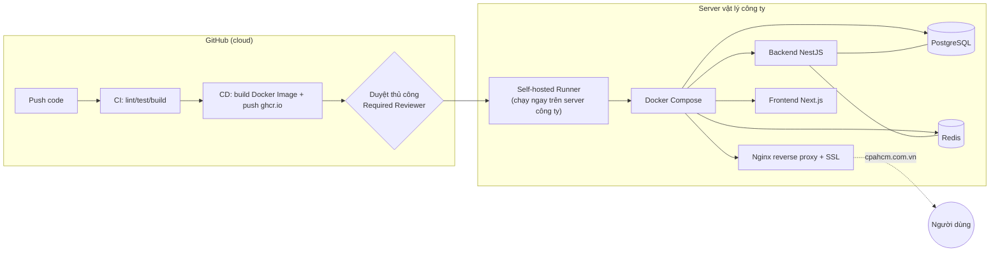

# Kế hoạch & Lộ trình Triển khai Hạ tầng Server, Bảo mật & Vận hành Web/App
### CPA HCM Portal — Production On-Premise

> Tài liệu tổng hợp, dùng làm điểm tra cứu chính. Chi tiết kỹ thuật sâu hơn nằm ở 3 file đi kèm — tài liệu này chỉ tóm tắt trạng thái + trỏ đúng chỗ cần đọc.

---

## 1. Bối cảnh

- **Công ty không có phòng IT** — toàn bộ hạ tầng server, bảo mật, vận hành do một mình bạn phụ trách từ đầu đến cuối.
- Hệ thống mới (NestJS + Next.js) sẽ **thay thế hoàn toàn** website cũ hiện đang chạy tại domain **`cpahcm.com.vn`** (trước đây do một bên làm web thuê ngoài phụ trách).
- Server: vật lý, đặt tại công ty (on-premise), nhiều khả năng **đã có sẵn hệ điều hành** nhưng chưa cài gì cho dự án này — chưa xác nhận 100% cho tới khi tiếp cận trực tiếp.
- Mục tiêu: đưa hệ thống lên chạy thật, có pipeline CI/CD tự động (code lên GitHub → tự kiểm tra → tự deploy), an toàn, có backup, có thể phục hồi khi có sự cố.

---

## 2. Kiến trúc tổng thể

- **Backend**: NestJS + Prisma ORM + PostgreSQL 15 + Redis 7
- **Frontend**: Next.js 16 (build chế độ `standalone`)
- **Container hoá**: Docker + Docker Compose, image build/push tự động qua GitHub Actions lên GitHub Container Registry (ghcr.io)
- **Reverse proxy**: Nginx, SSL miễn phí qua Let's Encrypt (certbot)
- **CI/CD**: GitHub Actions — CI chạy mọi push/PR, CD chạy khi vào nhánh `main` qua self-hosted runner cài ngay trên server

---

## 3. Lộ trình theo giai đoạn — trạng thái hiện tại

| # | Giai đoạn | Trạng thái | Ghi chú |
|---|---|---|---|
| 0 | Hạ tầng server (OS, Docker, hardening SSH/firewall) | 🟡 Code/script đã sẵn sàng, **chờ tiếp cận server thật** | Xem [SERVER_DAY1_GUIDE.md](SERVER_DAY1_GUIDE.md) |
| 1 | Quy trình Git & GitHub (repo, branch protection, environment) | ✅ **Xong** | Repo public: [HuuNhanHUST/cpahcm-portal](https://github.com/HuuNhanHUST/cpahcm-portal) |
| 2 | CI — kiểm tra tự động (lint/test/build) | ✅ **Xong** | `.github/workflows/ci.yml`, lint tạm không chặn merge (nợ kỹ thuật ~181 lỗi có sẵn) |
| 3 | CD — build & deploy tự động | ✅ Code xong / 🟡 chờ self-hosted runner cài trên server | `.github/workflows/cd.yml`, `scripts/deploy.sh` |
| 4 | Domain & SSL | 🟡 Domain đã cấu hình (`cpahcm.com.vn`), **chờ đổi DNS + cấp SSL lần đầu** | Xem Mục 5 |
| 5 | Database (setup + migration tự động) | ✅ **Xong** (đã test build/chạy migration thật) | Chi tiết: [CICD_ROADMAP.md](CICD_ROADMAP.md) Mục 4 |
| 6 | File/Ảnh upload (bind mount, không mất khi deploy) | ✅ **Xong** | Chi tiết: [CICD_ROADMAP.md](CICD_ROADMAP.md) Mục 5 |
| 7 | Giám sát & Backup | 🟡 Script backup/restore đã sẵn, **chờ setup cron trên server thật** | `scripts/backup-db.sh`, `backup-uploads.sh`, `restore-db.sh` |

**Chú thích**: ✅ xong hoàn toàn · 🟡 đã chuẩn bị sẵn, chờ thực hiện trên hạ tầng thật · ⬜ chưa bắt đầu

---

## 4. Bảo mật — nguyên tắc xuyên suốt

Vì không có ai khác kiểm tra lại, các nguyên tắc sau **bắt buộc tuân thủ**, không phải gợi ý tuỳ chọn:

1. **Không SSH bằng mật khẩu/root** — chỉ dùng SSH key, thực hiện qua 2 script tách biệt (`server-bootstrap-1-setup.sh` rồi mới `-2-harden-ssh.sh`) để tránh tự khoá mất quyền truy cập.
2. **Không public port database** — Postgres (5432)/Redis (6379) chỉ bind `127.0.0.1`, không lộ ra Internet.
3. **Firewall (UFW)** chỉ mở đúng 3 cổng: 22 (SSH), 80, 443.
4. **fail2ban** chặn brute-force SSH.
5. **Secrets không commit vào Git** — `.env`/`backend/.env` luôn nằm ngoài repo, đã kiểm tra kỹ toàn bộ lịch sử commit không rò rỉ secret nào.
6. **Migration database an toàn** — chỉ `prisma migrate deploy`, không bao giờ `migrate dev`/`db push` trên production; backup trước mỗi lần migrate.
7. **File upload không bao giờ mất** — bind mount ra ngoài container, cấm tuyệt đối `docker compose down -v`.
8. **Approval gate**: deploy lên production luôn cần duyệt thủ công qua GitHub Environment `production` (Required reviewer) trước khi thực sự chạy.

---

## 5. Domain & DNS — lưu ý quan trọng khi cutover

- Domain thật: **`cpahcm.com.vn`**, DNS hiện quản lý qua nameserver **PA Việt Nam**.
- **Có bản ghi MX thật đang hoạt động** (`mail.cpahcm.com.vn`, IP khác hẳn IP web) — email công ty đang chạy qua đây. **Khi đổi DNS, chỉ sửa bản ghi A/CNAME của website, tuyệt đối không đụng MX.**
- Còn thiếu: xác định ai đang giữ tài khoản đăng nhập PA Việt Nam để thực hiện đổi DNS lúc cutover, và xác nhận email thật dùng cho SSL Let's Encrypt (`CERTBOT_EMAIL`).
- Vì nginx cần có sẵn certificate mới khởi động được, nhưng certificate lại cần nginx chạy để xác thực (chicken-and-egg) — sẽ hướng dẫn cụ thể lệnh bootstrap SSL lần đầu khi đến đúng bước (sau khi DNS đã trỏ xong về IP server mới).

---

## 6. Việc đang chờ (theo thứ tự ưu tiên thực hiện)

1. **Tiếp cận server vật lý lần đầu** → làm theo [SERVER_DAY1_GUIDE.md](SERVER_DAY1_GUIDE.md), gửi lại kết quả 7 lệnh kiểm tra hệ thống.
2. **Cài đặt server** (2 script bootstrap) → chi tiết trong cùng file trên.
3. **Đăng ký self-hosted GitHub Actions runner** trên server, đúng thư mục repo đã clone.
4. **Xác nhận ai giữ tài khoản PA Việt Nam** → thực hiện đổi DNS trỏ về server mới.
5. **Bootstrap SSL lần đầu** (certbot) sau khi DNS đã trỏ đúng.
6. **Setup cron backup** hằng ngày (DB + file upload).
7. (Không gấp) Quyết định có cần Slack/Telegram thông báo deploy, và có thêm Playwright E2E vào CI hay không.
8. (Không gấp) Dọn dần ~181 lỗi ESLint có sẵn trong `backend/src`.

---

## 7. Tài liệu liên quan

| File | Nội dung |
|---|---|
| [CICD_ROADMAP.md](CICD_ROADMAP.md) | Kiến trúc chi tiết, giải pháp Database & File storage, giải thích khái niệm |
| [CICD_CHECKLIST.md](CICD_CHECKLIST.md) | Checklist đầy đủ từng việc cần cung cấp/thực hiện, đã đánh dấu xong/chưa |
| [SERVER_DAY1_GUIDE.md](SERVER_DAY1_GUIDE.md) | Hướng dẫn thao tác thực tế từng bước khi tiếp cận server lần đầu |

---
*Tạo ngày 2026-07-31 — tài liệu tổng hợp, cập nhật theo tiến độ thực tế mỗi khi có thay đổi.*
